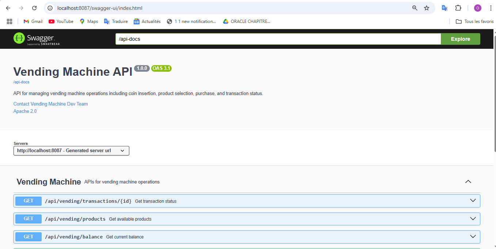
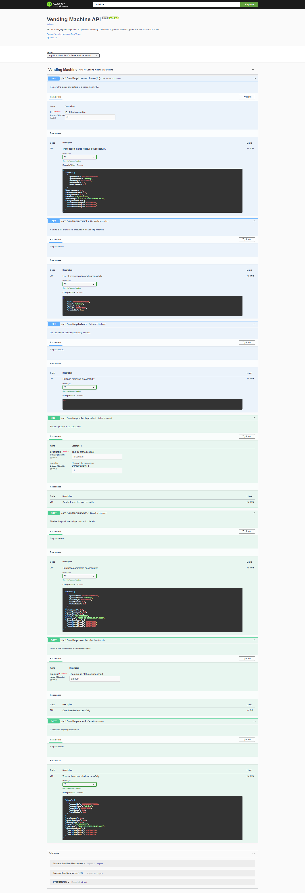
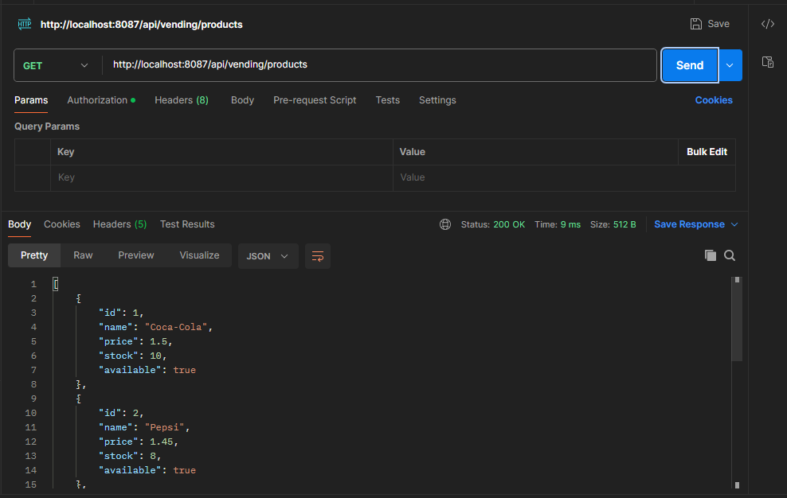
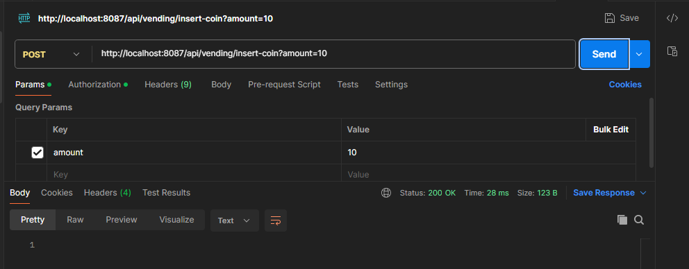
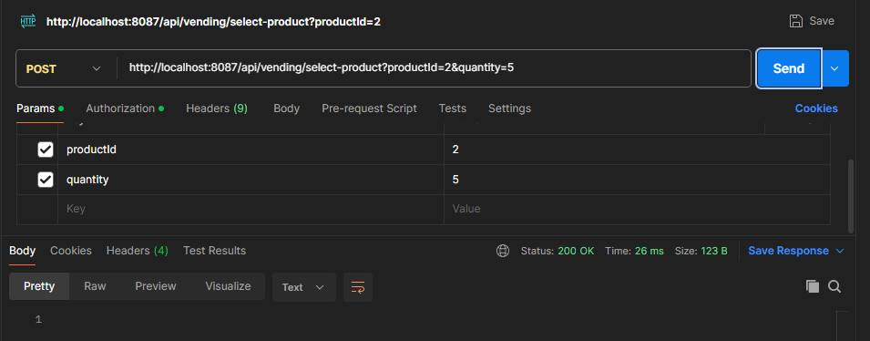
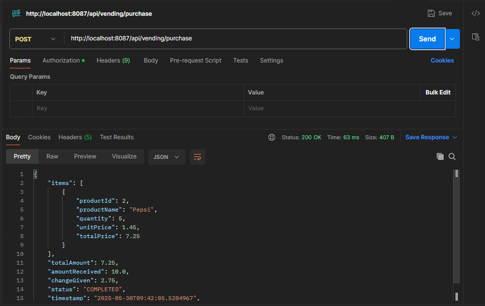
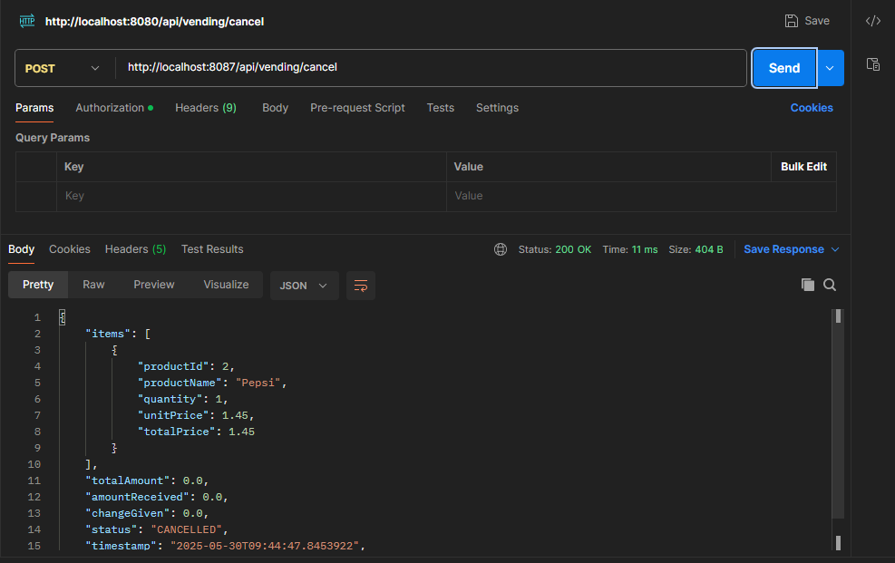
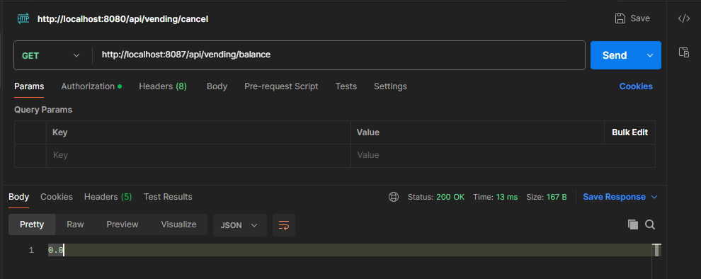
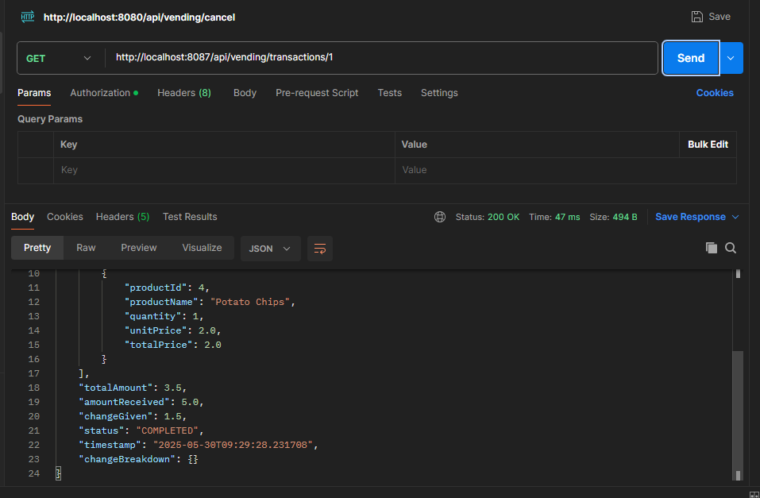

# Distributeur Automatique - API REST

## 📦 Instructions d’installation et de lancement

1. **Cloner le projet :**
   ```bash
   git clone   https://github.com/youssefoubens/Zenika_vinding_Machine.git 
   cd Zenika_vinding_Machine
   ```

2. **Construire le projet avec Maven :**
   ```bash
   ./mvnw clean install
   ```

3. **Lancer l’application :**
   ```bash
   ./mvnw spring-boot:run
   ```

4. **Accéder à la documentation Swagger :**
     
     
   
## 📮 Démonstration de l’API (via postman)

### 🛒 Obtenir la liste des produits disponibles
GET http://localhost:8080/api/vending/products


### 💰 Insérer une pièce
POST http://localhost:8080/api/vending/insert-coin?amount=2.0



### 📦 Sélectionner un produit
POST http://localhost:8080/api/vending/select-product?productId=1&quantity=1



### ✅ Compléter l’achat
POST http://localhost:8080/api/vending/purchase



### ❌ Annuler la transaction
POST http://localhost:8080/api/vending/cancel



### 🧾 Obtenir le solde actuel
GET http://localhost:8080/api/vending/balance



### 🔍 Vérifier le statut d’une transaction
GET http://localhost:8080/api/vending/transactions/1


💾 Moyens de stockage de données
ArrayList : Utilisé pour le stockage dynamique des données en mémoire, offrant flexibilité et simplicité.

Map : Exploité pour implémenter un algorithme glouton (greedy) dans la gestion optimale des pièces de monnaie ou des produits.

Base de données H2 : Employée pour stocker de manière persistante les informations relatives aux transactions, produits et éléments de transaction. Elle facilite le développement et les tests grâce à sa nature légère et embarquée.
## 🧠 Hypothèses ou ajouts personnels

- Le système utilise un solde global simulé en mémoire pour représenter les pièces insérées.
- Les produits sont préchargés à l'initialisation de l'application.
- Aucun mécanisme d’authentification n’est requis.
- Le changement rendu (si applicable) est géré automatiquement dans `completePurchase`.

## 📊  Diagramme de conception


